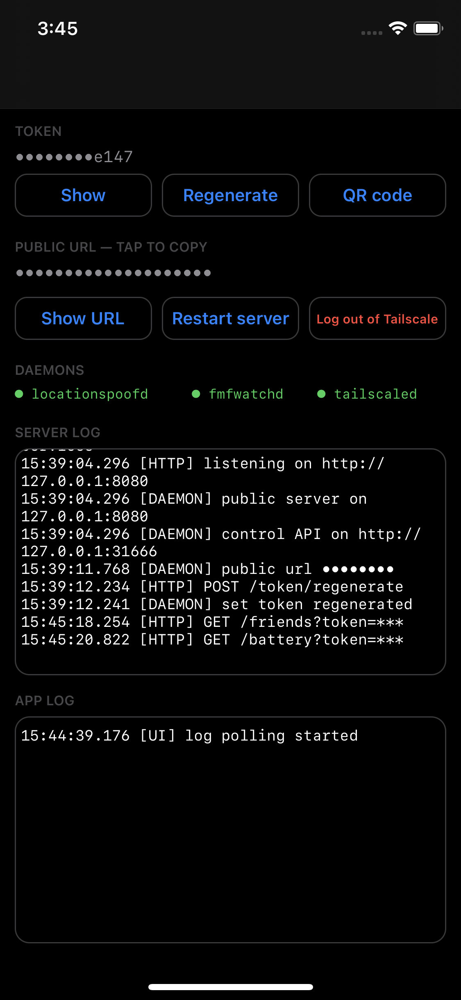

# LocationSpoofServer

An HTTP server for a jailbroken iPhone that sets the device's simulated location
on demand, and reports back battery level and the locations of your Find My
friends. It ships a small UI app, three LaunchDaemons, and a Tailscale node so
the phone can be reached from anywhere without a relay box in the middle.

The client is **[FindMyForwarder](https://github.com/jjoelj/FindMyForwarder)**,
an Android app that scans the QR code this one displays and takes it from there.
The API below is plain HTTP, though, so anything that can make a request works.



## Requirements

- A jailbroken iPhone. Developed against iOS 14.3 on a Taurine/libhooker
  device; the Tailscale workarounds below are specific to that vintage.
- Root SSH to the phone, with key auth set up, if you build from source or want
  the optional SSH-over-tailnet setup — `ssh root@<phone>` with no password.
- A [Tailscale](https://tailscale.com) account. Free tier is plenty; this is
  one node. The account is yours, and no traffic passes through anything the
  project controls. Without it the daemons still run and the server still works
  on-device, but nothing outside the phone can reach it.
- A package manager on the phone (Sileo, Zebra, Cydia — whatever your
  jailbreak shipped). Building from source instead additionally needs
  [theos](https://theos.dev) with an iOS SDK and Go 1.24+, as described below.

## What gets installed

| Path | What it is |
| --- | --- |
| `/Applications/LocationSpoofServer.app` | UI: token and public URL as text or QR, Tailscale login, server restart |
| `/usr/libexec/locationspoofd` | The server. Public API on `:8080`, control API on `127.0.0.1:31666` |
| `/usr/libexec/fmfwatchd` | Find My friends watcher, kept separate for entitlement reasons |
| `/usr/libexec/tsboot` | Starts tailscaled; launchd cannot spawn it directly (see below) |
| `/usr/local/bin/tailscaled`, `/usr/local/bin/tailscale` | Tailscale, userspace mode, socket at `/var/run/lss-tailscaled.socket` |
| `/usr/lib/securityshim.dylib` | Backfills one Security API that iOS 14 lacks (see below) |

Talking to our tailscaled from a shell needs the socket flag, since the default
path belongs to the Tailscale iOS app if you have it installed:

```sh
tailscale --socket=/var/run/lss-tailscaled.socket status
```

## Setup

### 1. Install

Add this source in your package manager, then install
**Location Spoof Server**:

```
https://jjoelj.github.io/locationspoofserver/
```

The daemons start with the package, so there is nothing to load by hand.

<details>
<summary>Or build it yourself</summary>

Needs [theos](https://theos.dev) with an iOS SDK and `$THEOS` set, plus Go 1.24+
on `PATH` for the Tailscale cross-build.

```sh
THEOS_DEVICE_IP=iphone make package install
```

Substitute your phone's hostname or IP. That cross-compiles Tailscale, builds
the app and daemons, and installs the `.deb` over SSH.

</details>

### 2. Log into Tailscale

Open LocationSpoofServer on the phone and tap **Log in to Tailscale**. It opens
the Tailscale login page in Safari; sign in, approve the node, and the app fills
in your public URL — something like `https://iphone.<tailnet>.ts.net`. Funnel is
turned on for you at that point.

The same button becomes **Log out of Tailscale** once connected, which drops the
node from your tailnet and takes the public URL down until you log in again.

Tailscale's state lives in `/var/lib/tailscale` and survives reboots and
upgrades, so this is a one-time step. Uninstalling is the exception — it logs
the node out and deletes the state, so a later reinstall logs in fresh.

If the Tailscale iOS app is already on the device holding the hostname you asked
for, your node gets the next free name (`iphone-1`).

### 3. Disable key expiry

Node keys expire after 180 days by default. When that happens the public URL
goes dark until someone re-authenticates on the phone. This is a headless
daemon; nobody is going to see that prompt.

In the [admin console](https://login.tailscale.com/admin/machines), find the
node, then ⋯ → **Disable key expiry**.

### 4. Check it works

Open your public URL in any browser. It answers `ok`.

Then open the app on the phone and scan the QR with
[FindMyForwarder](https://github.com/jjoelj/FindMyForwarder). The QR carries the
public URL and the token together, so there is nothing to type in.

The token and the URL are both masked until you tap **Show**, and whatever is
masked above is masked in the log panes below it too, so a screenshot of the
app leaks neither.

### Optional: SSH over the tailnet

`tailscaled` runs with `--tun=userspace-networking`, which means there is no
network interface for the OS to receive on — inbound tailnet traffic only
reaches services that Tailscale itself proxies. Funnel covers the spoof server;
SSH needs its own line:

```sh
tailscale --socket=/var/run/lss-tailscaled.socket serve --bg --tcp 2222 tcp://127.0.0.1:22
# then, from anywhere on the tailnet: ssh -p 2222 iphone
```

Do this *before* you remove any other Tailscale client from the device, or you
will lock yourself out of it.

## Uninstall

Remove it the way you installed it, from your package manager.

Removal leaves nothing behind. The package logs the node out of your tailnet on
its way out — otherwise it would linger there with Funnel on — and deletes the
node's private key in `/var/lib/tailscale`, the API token in
`/var/mobile/Library/LocationSpoofServer`, and its three logs in `/var/log`.

Upgrades are left alone: your login and token survive them.

## Releases

Work lands on `dev`. `main` is what has shipped: nothing writes it except the
**Release** workflow, run by hand from the Actions tab when `dev` is worth
shipping, and the weekly Tailscale bump below. It fast-forwards `main` to `dev`, tags `v` + whatever `Version:` in
`control` says, and starts the build. Bump `control` on `dev` first — releasing
a version that is already tagged fails instead of shipping.

Tagging by hand still works, and still has to agree with `control`:

```sh
git tag v0.2.0 && git push origin v0.2.0   # must match Version: 0.2.0 in control
```

Upgrades then arrive on the phone like any other package.
`.github/workflows/repo.yml` does it in one job:

1. **Clone Theos** — the build system this Makefile already includes.
2. **Fetch the toolchain and SDK** — a clang that emits Mach-O arm64 from Linux
   (`L1ghtmann/llvm-project`) and the patched `iPhoneOS16.5.sdk`
   (`theos/sdks`). Both are the same artefacts `install-theos` fetches for a
   local setup, pinned by release tag in the workflow's `env:` block, and
   cached on that pin. Bump the pins by hand when you want newer ones.
   `TAILSCALE_VERSION` in the Makefile is the exception:
   `.github/workflows/tailscale-update.yml` checks weekly and, on a new stable
   release, bumps it and `Version:` in `control`, tags, and ships — the one
   thing besides **Release** that writes `main`. It commits on top of `main`,
   not `dev`, so a Tailscale update never carries unfinished work with it. Merge
   `main` into `dev` yourself afterwards, or the next **Release** run is
   rejected for not being a fast-forward. The built binaries are cached on that
   version, so releases that do not move it skip the Go build entirely.
3. **Build** with `FINALPACKAGE=1` and `PACKAGE_VERSION=` the version from
   `control`. The override matters even though it repeats `control`: Theos
   otherwise appends its own build counter, which restarts at 1 on a fresh
   checkout and would look like a downgrade to the client.
4. **Index** — `dpkg-scanpackages` writes `Packages`, plus a hand-written
   `Release` naming the repo. That, a `Packages.gz` and the `.deb` under
   `debs/` is the whole of an APT repository.
5. **Deploy** to Pages with GitHub's own `upload-pages-artifact` and
   `deploy-pages` actions. No third-party actions are used anywhere.

One-time setup: **Settings → Pages → Source: GitHub Actions**. Without it the
deploy step fails. Manual runs (**Actions → Run workflow**) publish a
`0.1.0~ci<n>` build for testing; `~` sorts below the plain version, so the real tag supersedes it.

The published repo carries no GPG signature and no hashes in `Release`. The
jailbreak clients do not check either over HTTPS; `apt` on a desktop would.

## Why the Tailscale binaries need patching

Go cannot cross-compile for iOS without cgo, so `make package` builds
`GOOS=darwin` and `tools/ios_platform.py` fixes up the Mach-O afterwards. Three
things stand between a stock Go build and a binary that runs here:

- **`__DWARF` segment.** iOS's dyld rejects it outright, so the binaries are
  linked with `-ldflags="-s -w"`. This is load-bearing, not just size.
- **Platform and framework paths.** `LC_BUILD_VERSION` says macOS, and framework
  loads use the macOS `Foo.framework/Versions/A/Foo` layout. The patcher
  rewrites both.
- **`SecTrustCopyCertificateChain`.** Go's `crypto/x509` calls it
  unconditionally; Apple only shipped it in iOS 15. `tools/securityshim.m`
  defines it in terms of the old index-based API and re-exports Security, and
  the patcher points the binaries at the shim.

And one thing that is not patchable: **launchd cannot spawn `tailscaled`
directly.** The jailbreak's `pspawn_payload` hooks `posix_spawn` inside launchd
and injects itself into every job launchd starts, which SIGKILLs the Go runtime
a few seconds in — no crash report, no jetsam event, just signal 9. Anything
*we* spawn is untouched, so `/usr/libexec/tsboot` is what launchd runs, and it
spawns tailscaled itself. If tailscaled ever dies instantly under launchd but
runs fine from a shell, this is why.

## API

[FindMyForwarder](https://github.com/jjoelj/FindMyForwarder) speaks all of this
already; the rest of this section is for anything else you point at the phone.

Every endpoint except `/` requires `?token=...`. Get the token from the app —
it's shown as text and as a QR code — or from the device itself with
`curl 127.0.0.1:31666/token`. Tokens are 128 random bits, generated on the
device; there is no way to set one by hand.

| Endpoint | Does |
| --- | --- |
| `GET /` | Health check. `ok`. The only unauthenticated route |
| `GET /set?lat=..&lon=..&token=..` | Sets the simulated location |
| `GET /friends?token=..` | Cached Find My friend locations |
| `GET /friends/refresh?token=..` | Same, forcing a fresh fetch first |
| `GET /battery?token=..` | Battery level and charging state |

```sh
curl "https://iphone.<tailnet>.ts.net/set?lat=37.7749&lon=-122.4194&token=$TOKEN"
```

The token travels in the query string, so it will appear in the logs of
anything between you and the phone. Regenerate it from the app if you think it
has leaked; that invalidates the old one immediately.

## Logs

The app shows both live: SERVER LOG is the daemon's, APP LOG is the app's own.
On disk they are `/var/log/locationspoofd.log`, `/var/log/fmfwatchd.log` and
`/var/log/tailscaled.log`.
